# Advanced Mermaid Features

Advanced configuration, styling, theming, and other powerful features for creating professional diagrams.

**Color reference:** Use the palette in [SKILL.md](../SKILL.md), subject to the user's presentation preferences

## Frontmatter Configuration

Add YAML configuration at the top of diagrams:

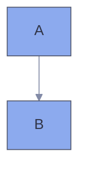

## Themes

### Built-in Themes

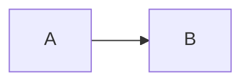

**Available themes:**
- `default` - Standard blue theme
- `forest` - Green earth tones
- `dark` - Dark mode friendly
- `neutral` - Grayscale professional
- `base` - Minimal base theme for customization

### Theme Examples

**Default Theme:**
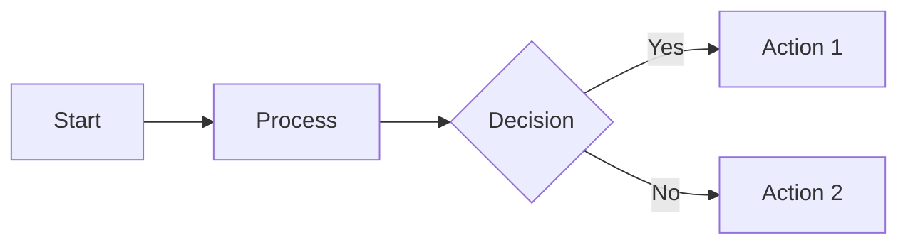

**Dark Theme:**
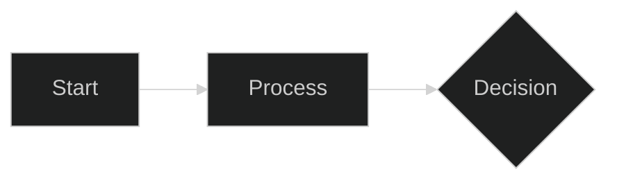

**Forest Theme:**
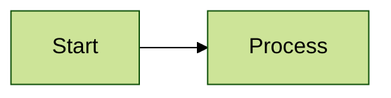

## Custom Theme Variables

Override specific colors:

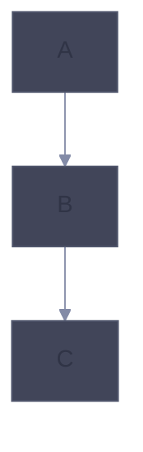

## Layout Options

### Dagre Layout (Default)

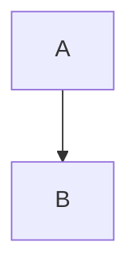

### ELK Layout (Advanced)

For complex diagrams with better automatic layout:

ELK must be available in the host's Mermaid integration. A successful CLI render does not prove GitHub, Obsidian, or another host loads the same layout engine. Compare the rendered result with Dagre; node count alone is not a selection rule

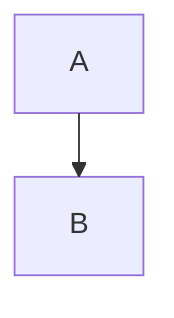

**ELK node placement strategies:**
- `SIMPLE` - Basic placement
- `NETWORK_SIMPLEX` - Network optimization
- `LINEAR_SEGMENTS` - Linear arrangement
- `BRANDES_KOEPF` - Balanced (default)

## Look Options

### Classic Look

Traditional Mermaid appearance:

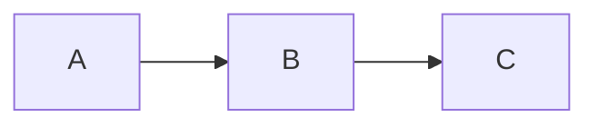

### Hand-Drawn Look

Sketch-like, informal style:

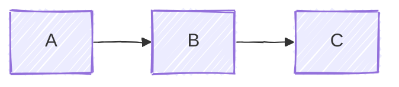

## Complete Configuration Example

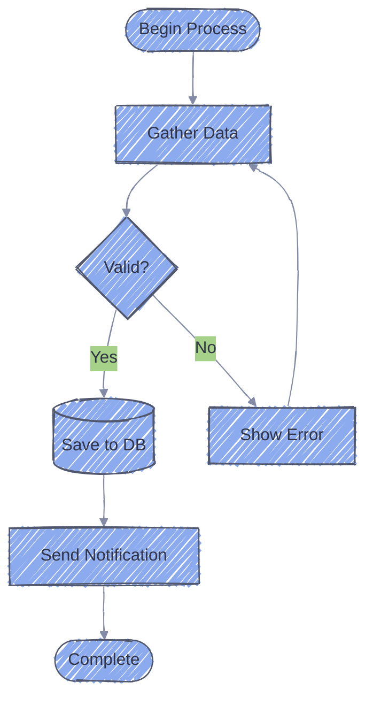

## Diagram-Specific Styling

### Flowchart Styling

**Class-based styling:**
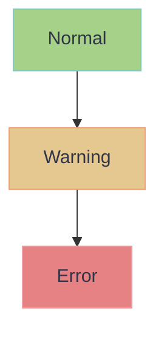

**Node-specific styling:**
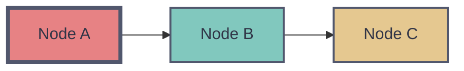

**Link styling:**
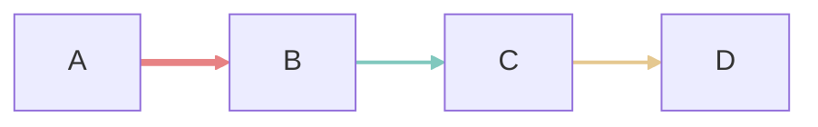

### Sequence Diagram Styling

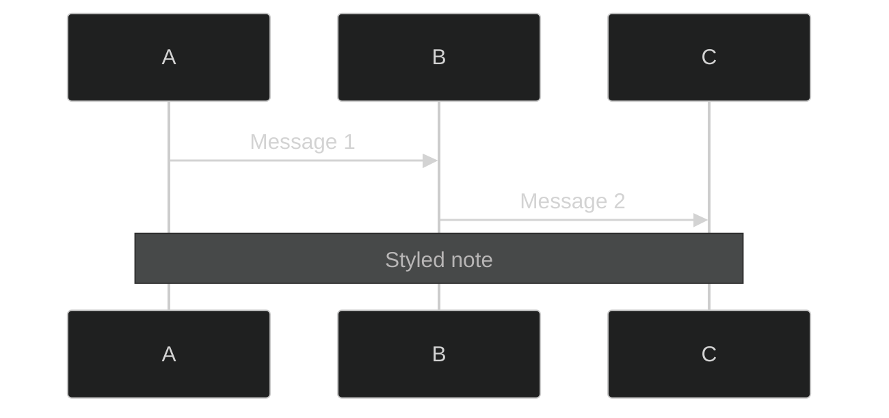

### Class Diagram Styling

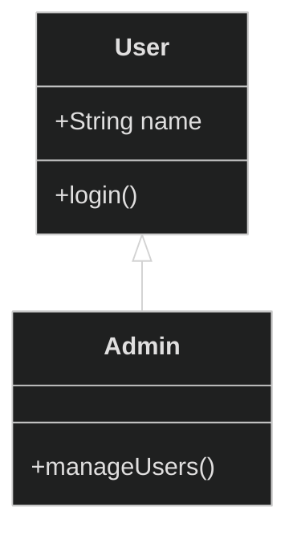

## Directional Hints

Set the overall layout direction. This example does not assign directions to individual nodes:

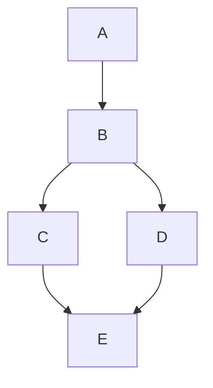

## Click Events and Links

Add interactive elements when the host permits them. Flowchart clicks and tooltips are disabled under `securityLevel: strict`. Do not change the host's security setting merely to make a diagram work; provide ordinary document links as a fallback. See [interaction support](https://mermaid.js.org/syntax/flowchart.html#interaction)

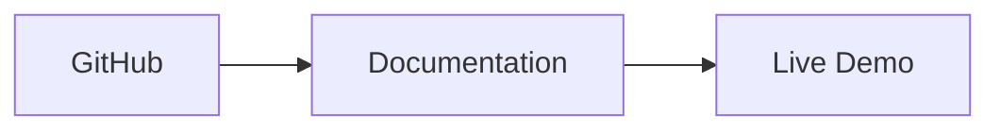

## Tooltips

Add hover information:

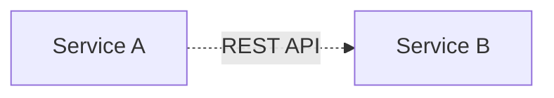

## Subgraph Styling

```mermaid
flowchart TB
    subgraph Frontend
        A[Web App]
        B[Mobile App]
    end

    subgraph Backend
        C[API]
        D[Database]
    end

    A & B --> C
    C --> D

    style Frontend fill:#414559,stroke:#8caaee,stroke-width:2px
    style Backend fill:#414559,stroke:#ef9f76,stroke-width:2px
```

## Comments and Documentation

```mermaid
flowchart TD
    %% This is a single-line comment

    %% Multi-line comments can be created
    %% by using multiple comment lines

    A[Start]
    B[Process]
    C[End]

    %% Define relationships
    A --> B
    B --> C

    %% Add styling
    style A fill:#a6d189,stroke:#81c8be,color:#303446
    style C fill:#f4b8e4,stroke:#ea999c,color:#303446
```

## Complex Styling Example

```mermaid
flowchart TB
    subgraph production[Production Environment]
        direction LR
        lb[Load Balancer]

        subgraph servers[Application Servers]
            app1[Server 1]
            app2[Server 2]
            app3[Server 3]
        end

        cache[(Redis Cache)]
        db[(PostgreSQL)]
    end

    subgraph monitoring[Monitoring]
        logs[Log Aggregator]
        metrics[Metrics Dashboard]
    end

    users[Users] --> lb
    lb --> app1 & app2 & app3
    app1 & app2 & app3 --> cache
    app1 & app2 & app3 --> db
    app1 & app2 & app3 --> logs
    logs --> metrics

    style production fill:#414559,stroke:#a6d189,stroke-width:3px
    style servers fill:#414559,stroke:#ef9f76,stroke-width:2px
    style monitoring fill:#414559,stroke:#8caaee,stroke-width:2px

    style lb fill:#e5c890,stroke:#ef9f76,stroke-width:2px,color:#303446
    style cache fill:#ca9ee6,stroke:#f4b8e4,stroke-width:2px,color:#303446
    style db fill:#ca9ee6,stroke:#f4b8e4,stroke-width:2px,color:#303446

    classDef serverClass fill:#a6d189,stroke:#81c8be,stroke-width:2px,color:#303446
    class app1,app2,app3 serverClass

    linkStyle 0,1,2,3 stroke:#a6d189,stroke-width:2px
    linkStyle 4,5,6,7,8,9 stroke:#ef9f76,stroke-width:1px
```

## Responsive Sizing

Use CSS to make diagrams responsive:

```html
<div style="max-width: 100%; overflow: auto;">
    <pre class="mermaid">
        flowchart LR
            A --> B --> C
    </pre>
</div>
```

## SVG Export Options

When exporting to SVG:

```bash
# Export with custom dimensions
mmdc -i diagram.mmd -o output.svg -w 1920 -H 1080

# Export with background color
mmdc -i diagram.mmd -o output.svg -b "#ffffff"

# Export with transparent background
mmdc -i diagram.mmd -o output.svg -b "transparent"
```

## Best Practices for Advanced Features

1. **Use the shared palette** - See [SKILL.md](../SKILL.md), with the user's preferences taking precedence
2. **Use themes consistently** - Pick one theme for related diagrams
3. **Don't over-style** - Too many colors can reduce clarity
4. **Test hand-drawn look** - Some diagrams work better with classic look
5. **Use ELK for complex layouts** - When dagre creates crossed lines
6. **Comment complex configurations** - Explain non-obvious styling choices
7. **Keep it accessible** - Ensure sufficient color contrast
8. **Test exports** - Verify diagrams render correctly in target format
9. **Version control configs** - Track theme changes in your repository

## Accessibility Considerations

```mermaid
---
config:
  theme: base
  themeVariables:
    primaryColor: "#8caaee"
    primaryTextColor: "#303446"
    primaryBorderColor: "#51576d"
    lineColor: "#838ba7"
    background: "#303446"
    mainBkg: "#414559"
---
flowchart TD
    A[High Contrast Text] --> B[Clear Labels]
    B --> C[Meaningful Colors]
```

**Accessibility tips:**
- Use high contrast color combinations
- Don't rely solely on color to convey meaning
- Include descriptive text labels
- Test with color blindness simulators
- Consider dark mode alternatives

## Performance Considerations

For large diagrams:

```mermaid
---
config:
  layout: elk
  elk:
    mergeEdges: true
---
flowchart TD
    A --> B
    A --> C
    B --> D
    C --> D
```

**Performance tips:**
- Compare ELK and Dagre on the actual diagram when crossings obscure relationships
- Enable edge merging for simplified connections
- Split very large diagrams into multiple focused views
- Consider using subgraphs to organize complexity
- Limit styling to essential elements

## Integration Examples

### Markdown Files

````markdown
# System Architecture

```mermaid
flowchart LR
    A --> B
```
````

### HTML Files

```html
<!DOCTYPE html>
<html>
<head>
    <script type="module">
        import mermaid from 'https://cdn.jsdelivr.net/npm/mermaid@11.17.2/dist/mermaid.esm.min.mjs';
        mermaid.initialize({
            startOnLoad: true,
            theme: 'dark',
            look: 'handDrawn'
        });
    </script>
</head>
<body>
    <pre class="mermaid">
        flowchart LR
            A --> B
    </pre>
</body>
</html>
```

### React Components

```jsx
import React from 'react';
import mermaid from 'mermaid';

mermaid.initialize({
    startOnLoad: true,
    theme: 'forest'
});

function DiagramComponent() {
    React.useEffect(() => {
        void mermaid.run();
    }, []);

    return (
        <div className="mermaid">
            flowchart LR
                A --> B
        </div>
    );
}
```
