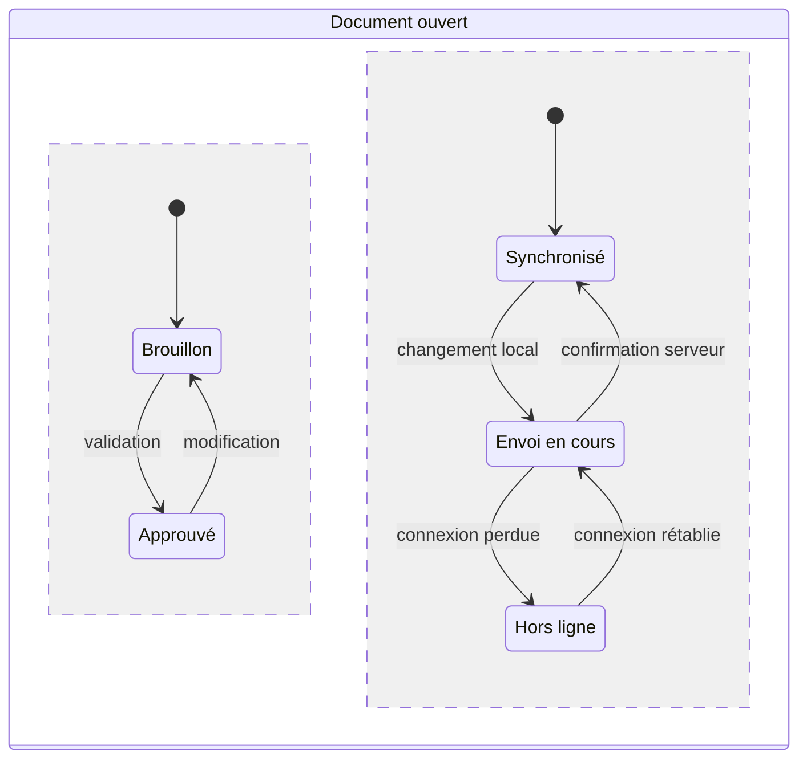
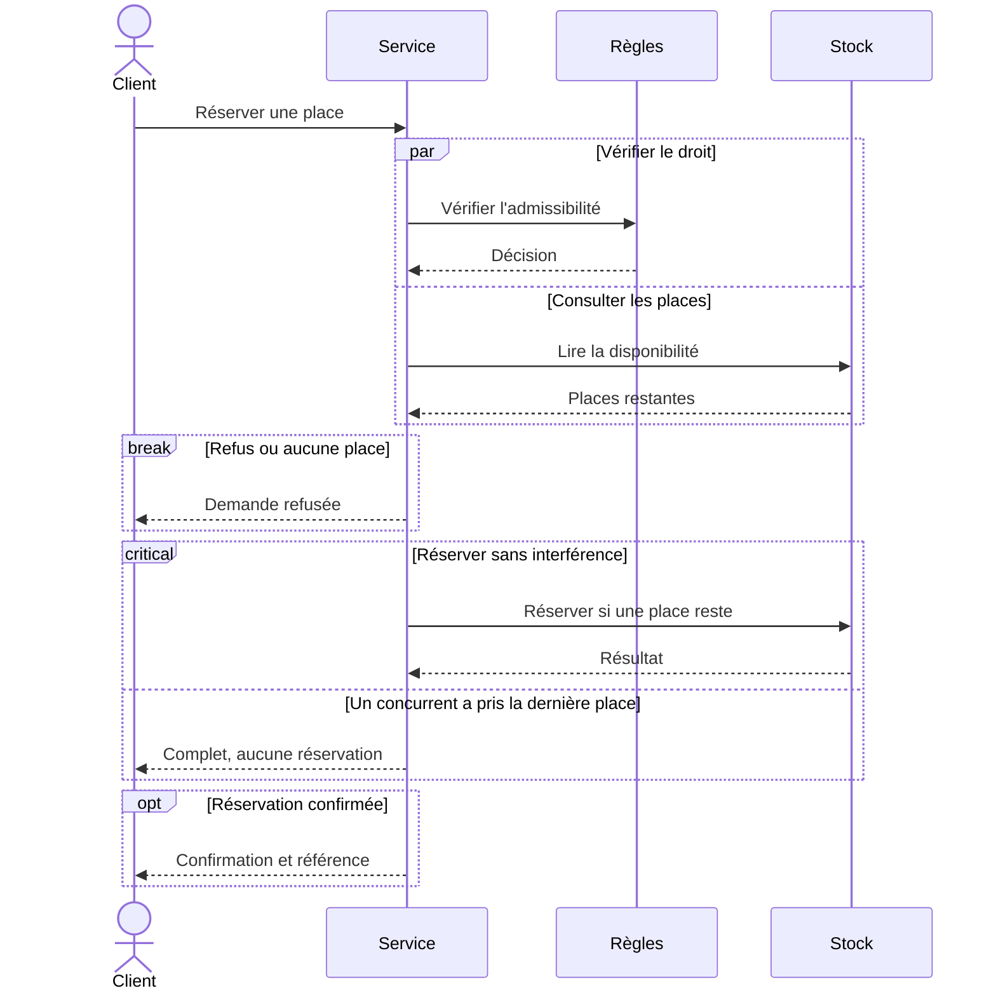
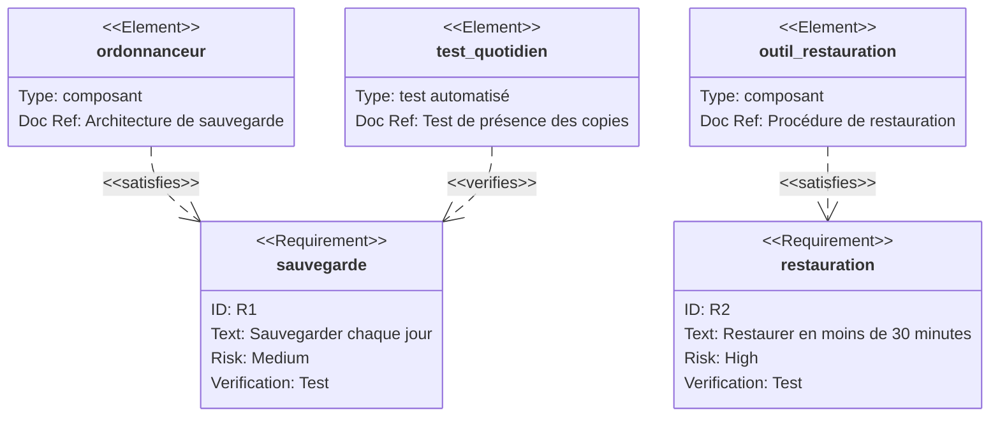
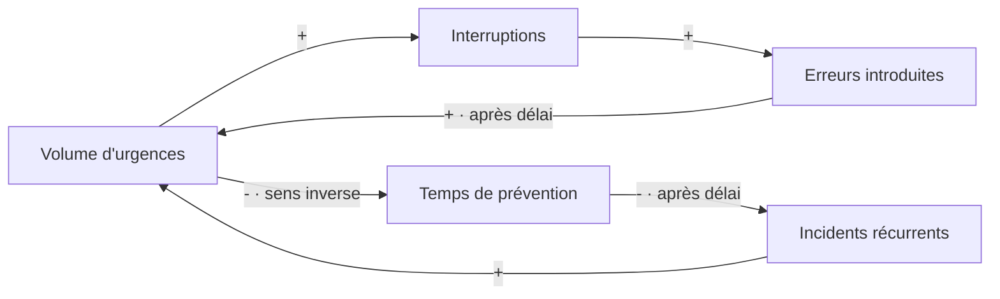

# Quatre façons de révéler un concept

Choisir le diagramme selon la question à résoudre. Les exemples ci-dessous décrivent des situations fictives. Ils montrent une structure à discuter, pas des observations mesurées.

## 1. Un document peut être approuvé et désynchronisé

**Question.** Quels états peuvent coexister ?

Une liste unique « brouillon, approuvé, hors ligne, synchronisé » mélange deux dimensions. Les régions concurrentes montrent que l'approbation et la synchronisation évoluent indépendamment. Deux états éditoriaux et trois états techniques donnent six combinaisons possibles sans dessiner six cases.

**Ce qu'on découvre.** Une interface qui n'affiche qu'un seul statut cache une information. « Approuvé » ne dit rien sur la présence de la dernière version au serveur.

**Autres usages.** Abonnement et paiement, état d'une commande et état de sa livraison, disponibilité d'un agent et connexion au réseau.

**Limites.** Les régions séparées par `--` expriment la concurrence. Mermaid ne simule pas les événements et ne vérifie pas les combinaisons interdites. Si certaines combinaisons sont illégales, les règles doivent être explicites dans le modèle métier. Les transitions entre états internes de composites différents ne sont pas prises en charge ; les styles à l'intérieur des composites sont aussi limités.

Source officielle : [états composites et concurrence](https://mermaid.js.org/syntax/stateDiagram.html#concurrency). Utiliser `stateDiagram-v2`. La page ne précise pas de version minimale pour `--` ; vérifier le moteur cible.

## 2. Deux vérifications simultanées, une seule réservation

**Question.** Qu'est-ce qui peut se produire en parallèle, et où faut-il empêcher les interférences ?

Le bloc `par` distingue le travail simultané. `break` montre la sortie qui coupe le scénario. `critical` rend visible l'opération à protéger contre une réservation concurrente.

**Ce qu'on découvre.** Lire « une place restante » n'accorde aucun droit sur cette place. Le diagramme expose la fenêtre entre lecture et réservation, puis nomme l'opération qui doit gérer le conflit.

**Autres usages.** Allocation de budget, inscription à une formation, attribution d'une tâche à un agent, validation parallèle suivie d'une publication unique.

**Limites.** Les cadres représentent le contrat souhaité. `critical` n'installe aucun verrou et ne prouve aucune atomicité. Le code et le stockage doivent fournir la garantie. La hauteur du dessin n'est pas une durée mesurée. Un `break` conditionnel coupe la suite seulement dans le cas nommé par son libellé.

Source officielle : [parallélisme, régions critiques et arrêt](https://mermaid.js.org/syntax/sequenceDiagram.html#parallel). Ces blocs n'ont pas de minimum de version indiqué sur la page consultée. L'exemple évite les nouvelles flèches et les nouveaux types de participants.

## 3. Une fonctionnalité livrée peut rester sans preuve

**Question.** Pour chaque promesse, connaît-on à la fois ce qui la réalise et ce qui la vérifie ?

Un diagramme d'exigences distingue l'implémentation, avec `satisfies`, de la vérification, avec `verifies`. Ici, la restauration a un composant désigné mais aucun test relié.

**Ce qu'on découvre.** Une copie présente ne prouve pas une restauration possible dans le délai promis. Le prochain travail utile devient un exercice de restauration chronométré.

**Autres usages.** Critères d'acceptation, exigences de performance, décisions d'architecture reliées à leurs contraintes, exigences contractuelles reliées aux essais.

**Limites.** Les liens sont des déclarations de traçabilité, pas des preuves de satisfaction ou de succès. `verifymethod: test` désigne une méthode prévue, pas un test passé. L'absence de lien signale un manque dans ce diagramme, sans démontrer que le test n'existe nulle part. `docref` est du texte documentaire, pas une intégration automatique avec un registre de tests.

Source officielle : [exigences et relations](https://mermaid.js.org/syntax/requirementDiagram.html). La page décrit une notation inspirée de SysML 1.6, ce qui ne signifie pas que Mermaid implémente tout SysML. Elle ne précise pas le minimum de version de la syntaxe de base utilisée ici.

## 4. Pourquoi traiter les urgences peut en créer davantage

**Question.** Quel mécanisme entretient le problème, et où intervenir ?

Un flowchart peut représenter des influences entre variables au lieu d'étapes d'un processus. Le signe `+` signifie « varie dans le même sens », `-` signifie « varie en sens inverse », toutes choses égales par ailleurs. Il ne signifie pas bon ou mauvais.

**Ce qu'on découvre.** Les deux circuits renforcent le problème. Dans le premier, davantage d'urgences crée davantage d'interruptions et d'erreurs. Dans le second, les urgences réduisent la prévention ; les incidents récurrents augmentent ensuite. Deux influences négatives dans une boucle donnent ici un effet global de renforcement.

Protéger une plage de prévention devient une hypothèse d'intervention à tester. Son effet retardé explique pourquoi l'abandonner après deux jours pourrait être prématuré.

**Autres usages.** Dette technique, files d'attente, adoption d'un produit, charge de soutien, apprentissage et confiance.

**Limites.** Mermaid ne possède pas ici une notation causale native. Nous construisons une convention avec un flowchart et sa légende. Ce dessin exprime des hypothèses causales ; il ne les établit pas à partir de corrélations. Il ne calcule ni intensité, ni délai, ni équilibre. Pour tester quantitativement la dynamique, utiliser un modèle de simulation avec données et équations.

Source officielle pour la syntaxe : [flowcharts et étiquettes de liens](https://mermaid.js.org/syntax/flowchart.html). L'interprétation causale est une adaptation de l'exemple, pas une fonctionnalité d'analyse de Mermaid. Aucun ajout récent, icône ou moteur ELK n'est requis par cet exemple.

## Choisir sans surcharger

| Ce que la discussion doit révéler | Vue à essayer |
|---|---|
| Deux dimensions que le mot « statut » confond | Régions concurrentes d'un diagramme d'états |
| Une course entre acteurs ou une interruption du scénario | Séquence avec `par`, `critical`, `break` |
| Une promesse sans vérification reliée | Diagramme d'exigences |
| Un problème entretenu par ses propres conséquences | Flowchart d'influences avec signes et délais |

Documentation officielle consultée le 6 septembre 2026. Pour une livraison, consigner la version réellement rendue et inspecter le résultat dans le lecteur prévu. La disponibilité de la syntaxe ne garantit pas celle du moteur embarqué par GitHub, Obsidian ou un autre outil.
