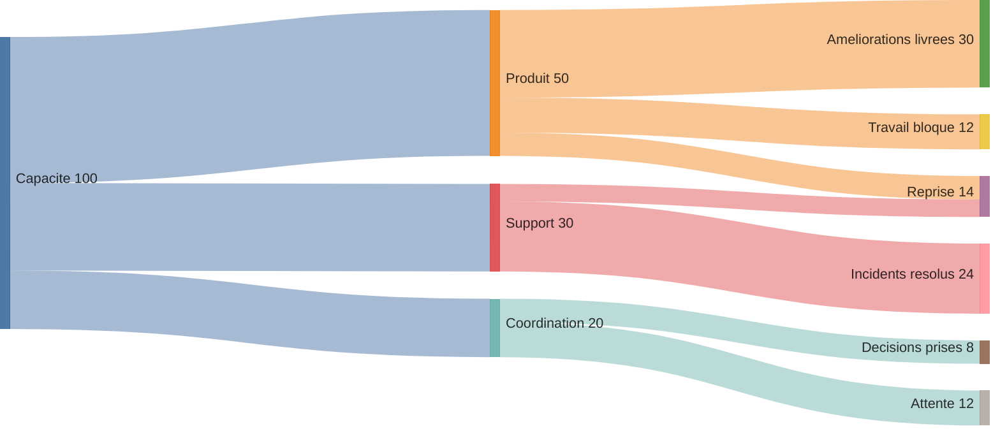
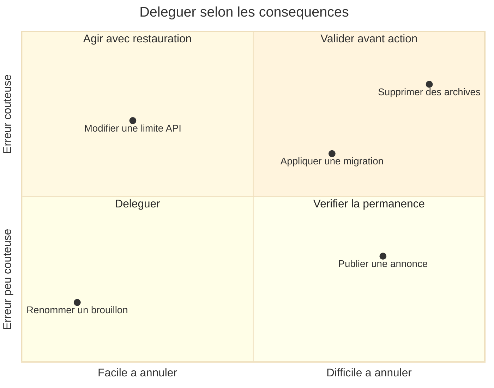
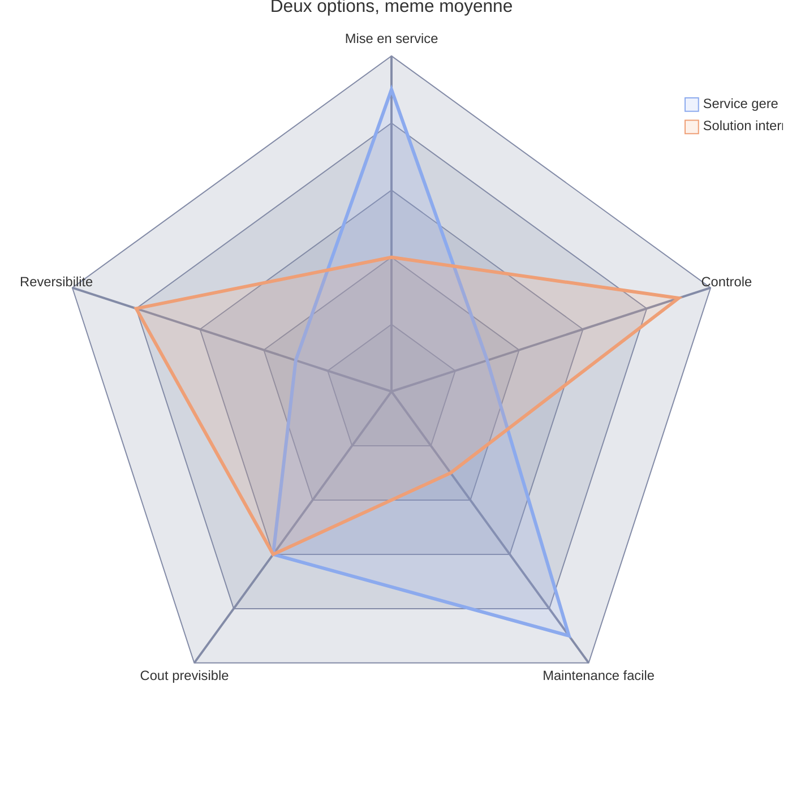
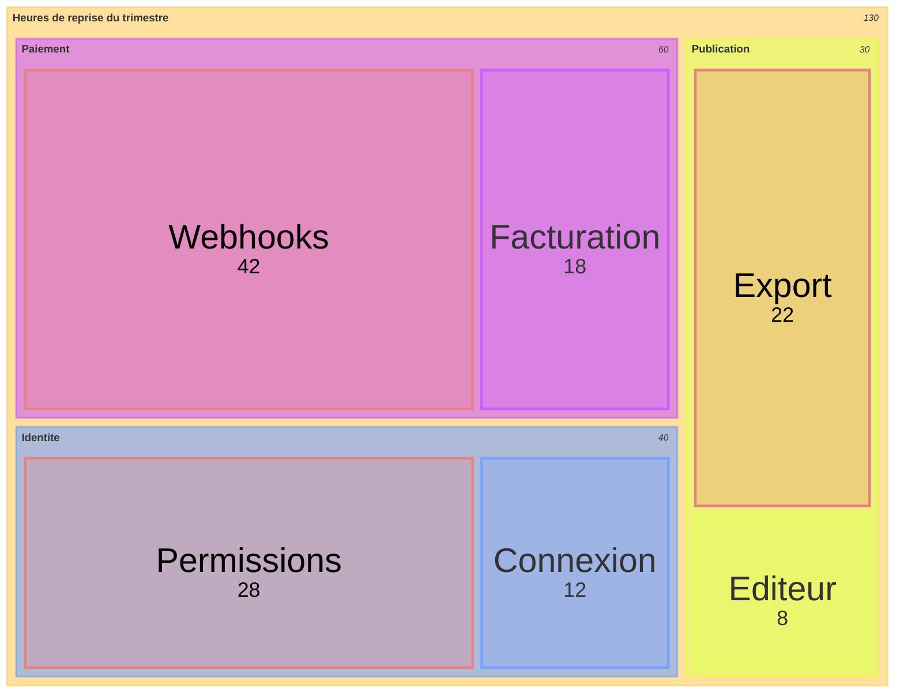

# Quatre façons de regarder les mêmes décisions

Ces exemples utilisent des données fictives. Ils montrent comment changer la question posée aux données, puis choisir la forme qui permet d'y répondre. Les nombres sont des exemples pédagogiques, jamais des mesures du projet.

Documentation officielle consultée le 6 septembre 2026. Une application peut embarquer une version plus ancienne que le site Mermaid. Valider le rendu dans l'application de destination, même si le CLI accepte le diagramme.

## Sankey : où disparaît la capacité disponible ?

Question : sur 100 heures de capacité hebdomadaire, combien atteignent réellement les améliorations livrées ?

Une liste de tâches cache les pertes entre les étapes. Le Sankey donne une largeur aux flux. Ici, les 50 heures consacrées au produit deviennent 30 heures livrées, 12 heures bloquées et 8 heures reprises. Le diagramme rend la discussion sur les interruptions et la reprise beaucoup plus concrète.

Réutilisations utiles : budget absorbé par les coûts indirects, visiteurs qui abandonnent chaque étape, énergie perdue entre conversion et usage, documents qui attendent une validation.

- Utiliser une seule unité et une seule période pour tous les flux
- Vérifier les sommes à chaque nœud intermédiaire ; ici 50 = 30 + 12 + 8 et 30 = 24 + 6
- Un même total traverse plusieurs étapes ; additionner toutes les lignes compterait les heures plusieurs fois
- Montrer explicitement les pertes, sorties ou variations de stock si les entrées et sorties diffèrent
- Un flux ne prouve aucune cause ; le diagramme ne dit pas pourquoi le travail reste bloqué
- Préférer un graphe sans cycle ; pour représenter une reprise dans le temps, distinguer les étapes ou périodes au lieu de fermer une boucle

Syntaxe : après `sankey-beta`, exactement trois colonnes CSV, `source,target,value`. Une virgule dans un nom exige des guillemets CSV. Ne pas transposer les flèches de flowchart dans ce format.

Disponible depuis Mermaid 10.3.0. La documentation qualifie encore ce type d'expérimental. `nodeColors`, `labelStyle: outlined`, `nodeWidth` et `nodePadding` demandent 11.15.0 ou plus ; cet exemple ne les utilise pas. [Documentation officielle Sankey](https://mermaid.js.org/syntax/sankey.html)

## Quadrant : quelles décisions peut-on déléguer ?

Question : quelles décisions méritent une validation humaine avant exécution ?

Les axes croisent le coût d'une erreur et la difficulté à revenir en arrière. Ce choix distingue deux décisions urgentes qui ne devraient pas recevoir la même autonomie. Une restauration rapide peut rendre acceptable une erreur coûteuse ; une petite modification permanente peut demander une autre forme de contrôle.

Les scores sont des estimations normalisées de 0 à 1. Le seuil 0,5 signifie ici une séparation convenue par l'équipe, pas une propriété naturelle des données.

Réutilisations utiles : certitude contre coût d'erreur pour choisir les expériences, valeur contre dépendance externe pour ordonner une feuille de route, fréquence contre délai de détection pour cibler l'observabilité.

- Nommer ce que signifient 0, 0,5 et 1 avant de placer les points
- Garder les mêmes axes et seuils pour comparer deux versions
- Une position est une estimation ; afficher plus de décimales ne la rend pas plus fiable
- Ce format ne trace ni intervalles d'incertitude ni trajectoires ; préférer un autre outil pour ces besoins
- Les rayons de points peuvent être personnalisés, mais une troisième mesure demande une légende et une conversion correcte entre valeur et aire

Syntaxe : `quadrant-1` est en haut à droite, puis la numérotation tourne dans le sens antihoraire. Les coordonnées doivent rester entre 0 et 1. La page officielle ne précise pas de version minimale ; vérifier le moteur de destination. [Documentation officielle quadrant](https://mermaid.js.org/syntax/quadrantChart.html)

## Radar : deux solutions ont la même moyenne, mais pas les mêmes faiblesses

Question : une note globale suffit-elle à choisir notre mode d'exploitation ?

Ces deux options obtiennent 6 sur 10 en moyenne simple. Leur profil révèle pourtant des compromis opposés. L'option gérée favorise la mise en service et la maintenance ; l'option interne favorise le contrôle et la réversibilité. Le creux devient le sujet de la discussion.

Chaque axe utilise une échelle de satisfaction de 0 à 10, où 10 est toujours préférable. Ces notes fictives décrivent ce scénario, pas tous les services gérés ou toutes les solutions internes.

Réutilisations utiles : maturité d'une équipe avant et après une intervention, exigences face à une proposition fournisseur, dette opérationnelle selon plusieurs capacités.

- Donner la règle de notation de chaque axe ; inverser les coûts et délais si une valeur élevée doit toujours être préférable
- Fixer `min`, `max` et l'ordre des axes pour comparer les vues
- Ne pas traiter la surface du polygone comme une note globale ; elle dépend aussi de l'ordre des axes
- Limiter le nombre de courbes pour garder les différences lisibles
- Utiliser des barres ou un tableau si la comparaison exacte des valeurs domine la lecture du profil

Syntaxe : chaque courbe contient une valeur par axe, dans l'ordre déclaré. Mermaid accepte aussi des paires `axisId: value` pour rendre l'association explicite. Disponible depuis 11.6.0 avec `radar-beta`. [Documentation officielle radar](https://mermaid.js.org/syntax/radar.html)

## Treemap : la dette se concentre-t-elle là où le code est volumineux ?

Question : quels domaines absorbent le plus d'heures de reprise ?

L'aire représente les heures de reprise du trimestre, regroupées par domaine. Le contour rouge désigne les causes récurrentes observées, à partir d'un classement distinct. Un petit module peut ainsi occuper le plus grand rectangle sans contenir beaucoup de code. On discute de coût de maintenance plutôt que de taille de fichiers.

Les causes récurrentes totalisent 92 heures sur 130. Cette somme vient des données, elle n'est pas calculée par une couleur. Les 42 heures des webhooks rendent cette zone prioritaire pour une enquête, sans démontrer quelle correction serait rentable.

Réutilisations utiles : poids des pièces jointes dans un coffre de notes, temps de support par famille de demandes, consommation cloud par équipe et service, âge cumulé des dossiers en attente par responsabilité.

- Choisir une mesure additive, puis une hiérarchie sans double comptage
- Ne pas encoder un taux brut par aire ; un taux de panne ne se somme pas entre services
- Éviter les valeurs négatives et les hiérarchies profondes
- Les petites surfaces masquent leurs libellés ; regrouper les éléments secondaires si nécessaire
- Une seconde mesure par contour exige une légende, comme la récurrence ici
- Préférer des barres pour lire un classement précis ; le treemap sert à voir la composition et la concentration

Syntaxe : l'indentation porte la hiérarchie. Un parent a un nom entre guillemets ; une feuille ajoute `: valeur`. `:::classe` et `classDef` permettent de signaler une catégorie. La page officielle ne donne pas de minimum de version et avertit que la syntaxe `treemap-beta` peut évoluer. [Documentation officielle treemap](https://mermaid.js.org/syntax/treemap.html)

## Quand choisir XY à la place

Utiliser un graphique XY quand la question porte sur une tendance, un écart à un seuil ou une comparaison exacte dans le temps. Par exemple, comparer chaque semaine le nombre de demandes reçues et résolues peut révéler l'accumulation d'une file avant que son volume total devienne alarmant. Les séries doivent partager une unité, ou être séparées en plusieurs vues. Ne pas utiliser un radar pour ces séries temporelles.

La documentation décrit les barres et les lignes, les axes numériques ou catégoriels et l'orientation horizontale. Vérifier la syntaxe disponible dans le moteur de destination. [Documentation officielle XY](https://mermaid.js.org/syntax/xyChart.html)
