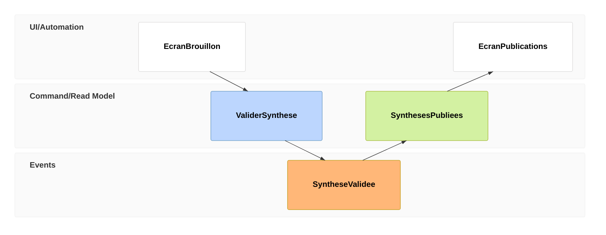

# Changer la question avec les nouveaux diagrammes

Trois façons de voir un projet avant de dessiner son architecture. Les situations et positions ci-dessous sont fictives. Elles servent à discuter une décision, jamais à lui donner une précision artificielle.

## Compatibilité à vérifier dans le moteur cible

La documentation officielle consultée le 6 septembre 2026 annonce ces versions minimales. Ce sont des types Mermaid documentés, pas des plugins à installer séparément. Leur présence dans la documentation ne garantit pas leur disponibilité dans une intégration qui embarque une ancienne version.

| Type | Première version annoncée | Usage distinctif |
|---|---|---|
| `wardley-beta` | 11.14.0 | Dépendances, maturité et choix construire ou acheter |
| `cynefin-beta` | 11.16.0 | Choisir comment décider selon l'incertitude |
| `eventmodeling` | 11.15.0 | Relier action utilisateur, fait enregistré et information affichée |
| `swimlane-beta` | 11.16.0 | Montrer les changements de responsabilité dans un processus |
| `venn-beta` | 11.12.3 | Montrer les recouvrements d'ensembles |
| Ishikawa | 11.12.3 | Organiser les causes possibles d'un problème |
| `treeView-beta` | 11.14.0 | Annoter une arborescence de fichiers ou de concepts |

Les suffixes `beta` font partie de la syntaxe. Valider avec une version épinglée du moteur puis regarder le rendu. Si l'hôte ne sait pas les afficher, livrer un SVG rendu avec cette version et conserver la source.

## Wardley : où investir ton effort distinctif ?

Question : quelles dépendances de ton produit méritent du développement maison, et lesquelles devraient devenir des services achetés ?

Une architecture montre que la synthèse dépend de la transcription. Une carte de Wardley ajoute la maturité de chaque capacité. Ici, la synthèse adaptée à ton métier reste à inventer, alors que le stockage est déjà un service courant. Les flèches d'évolution expriment une intention de déplacement, pas un calendrier.

```mermaid
---
config:
  themeVariables:
    wardley:
      gridColor: "#51576d"
---
wardley-beta
  title Du verbatim a une decision utile
  size [1100, 650]
  component Decideur [0.95, 0.45]
  component Synthese maison [0.78, 0.22] (build)
  component Recherche [0.58, 0.50]
  component Transcription [0.40, 0.55] (inertia)
  component Stockage achete [0.18, 0.90] (buy)
  Decideur -> Synthese maison
  Synthese maison -> Recherche
  Recherche -> Transcription
  Transcription -> Stockage achete
  evolve Transcription 0.85
  note "Differenciation a explorer" [0.87, 0.12]
  note "Standardisation envisagee" [0.28, 0.68]
```

Ce que cette vue permet de découvrir : un composant techniquement difficile peut être devenu banal sur le marché. Continuer à le fabriquer peut consommer l'effort nécessaire à la capacité qui distingue le produit.

À lire correctement : les coordonnées sont `[visibilité, évolution]`, donc l'ordre inverse des habituels `[x, y]`. La hauteur exprime la proximité avec le besoin utilisateur. Elle ne mesure ni le coût ni la priorité. `build` et `buy` décrivent une stratégie envisagée, pas une recommandation automatique. Le marqueur `inertia` signale une résistance à examiner, pas une faute.

Limites : les positions demandent une discussion et des preuves de marché. Cette carte ne calcule pas un retour sur investissement. Le mode `handDrawn` n'est pas pris en charge.

Rendu 11.17.2 : le texte de l’ancre est noir par défaut dans le SVG, même sur un canevas noir. Le moteur ignore aussi `themeCSS` pour ce type. Cet exemple emploie donc un `component` pour le décideur, à la place de `anchor`. Revalider cette correction locale après une mise à jour du moteur.

Source : [syntaxe officielle Wardley](https://mermaid.js.org/syntax/wardley.html)

## Cynefin : faut-il expérimenter, analyser ou appliquer une procédure ?

Question : pourquoi une méthode efficace pour réparer un bug connu échoue-t-elle à découvrir un nouveau produit ?

Cette vue classe les situations selon la manière dont on peut comprendre leurs causes. Elle aide à choisir le prochain geste. Les transitions montrent comment la connaissance peut changer la nature du travail.

```mermaid
---
config:
  themeVariables:
    cynefin:
      complexBg: "#303446"
      complicatedBg: "#303446"
      clearBg: "#303446"
      chaoticBg: "#303446"
      confusionBg: "#303446"
      textColor: "#ffffff"
      labelColor: "#ffffff"
      boundaryColor: "#8caaee"
      cliffColor: "#e78284"
      arrowColor: "#81c8be"
      itemFontSize: "16px"
  cynefin:
    width: 1100
    height: 750
    seed: 42
---
cynefin-beta
  title Choisir la prochaine action
  accTitle: Adapter la methode a la situation
  accDescr: Les situations connues appellent une procedure, les inconnues une enquete ou une experience
  complex
    "Trouver un usage qui retient les clients"
  complicated
    "Diagnostiquer une latence intermittente"
  clear
    "Renouveler un certificat connu"
  chaotic
    "Retablir un service indisponible"
  confusion
    "Qualifier une alerte nouvelle"
  chaotic --> complex : "Service stabilise"
  complex --> complicated : "Regularite observee"
  complicated --> clear : "Procedure eprouvee"
```

Ce que cette vue permet de découvrir : demander une estimation ferme à une exploration peut créer une fausse certitude. À l'inverse, refaire une expérimentation pour chaque tâche déjà maîtrisée gaspille du temps. Une situation complexe appelle de petites expériences ; une situation compliquée appelle de l'analyse experte.

Limites : ce n'est pas une matrice urgence × difficulté. Les domaines ont une signification et une position fixes. Classer une situation exige du contexte ; une panne n'est pas toujours chaotique si sa procédure de reprise est connue. Garder très peu d'éléments par domaine pour éviter les débordements. Fixer `seed` stabilise la forme des frontières entre rendus.

Source : [syntaxe officielle Cynefin](https://mermaid.js.org/syntax/cynefin.html)

## Event modeling : que sait le système, et quand l'utilisateur peut-il le voir ?

Question : quelle information doit exister après une action pour que l'écran suivant ait un sens ?

L'exemple suit une validation éditoriale. La commande exprime l'intention. L'événement exprime ce qui a été enregistré. Le modèle de lecture fournit l'information que l'écran peut montrer. Ces distinctions rendent visible un oubli fréquent dans les spécifications : une écriture réussie ne décrit pas encore ce que l'utilisateur verra.



Ce que cette vue permet de découvrir : l'équipe peut avoir défini l'action et son stockage tout en oubliant le modèle de lecture qui alimente la liste publique. Le diagramme force à expliquer le passage du fait enregistré à l'information présentée.

Pour approfondir un atelier, ajouter un exemple de données à chaque étape, puis plusieurs événements qui alimentent la même vue. Les espaces de noms créent des couloirs distincts. `rf` interrompt l'inférence automatique des relations ; `->>` permet de préciser plusieurs relations.

Limites : les relations sont inférées par défaut. Vérifier qu'elles correspondent au métier. Les numéros `tf` identifient les étapes ; ils ne représentent pas une durée. Cette représentation n'impose pas d'adopter CQRS ou event sourcing et ne remplace pas une séquence pour expliquer les échanges réseau, délais et reprises.

Rendu 11.17.2 : les couloirs ont un fond clair codé dans le SVG. Le correctif `themeCSS` garde les libellés et les flèches lisibles sur fond noir. Les sélecteurs de couleurs ciblent cette version ; revalider après une mise à jour.

Source : [syntaxe officielle Event Modeling](https://mermaid.js.org/syntax/eventmodeling.html)

## Autres pistes à sortir au bon moment

- [Swimlanes](https://mermaid.js.org/syntax/swimlanes.html) pour voir où le travail attend une autre équipe ; placer une décision dans le couloir de son propriétaire
- [Venn](https://mermaid.js.org/syntax/venn.html) pour montrer les recouvrements entre utilisateurs, capacités ou périmètres ; vérifier la cohérence des tailles avant toute lecture quantitative
- [Ishikawa](https://mermaid.js.org/syntax/ishikawa.html) pour explorer plusieurs familles de causes avant de choisir quoi mesurer ; les branches représentent des hypothèses, pas des causes prouvées
- [TreeView](https://mermaid.js.org/syntax/treeView.html) pour expliquer une arborescence avec descriptions `##` et éléments mis en évidence ; les icônes externes nécessitent leur enregistrement par l'hôte
