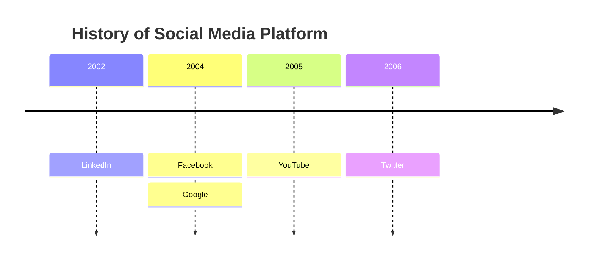
```mermaid
timeline
    title History of Social Media Platform
    2002 : LinkedIn
    2004 : Facebook
         : Google
    2005 : YouTube
    2006 : Twitter
```

```mermaid
timeline
    title History of Social Media Platform
    2002 : LinkedIn
    2004 : Facebook : Google
    2005 : YouTube
    2006 : Twitter
```

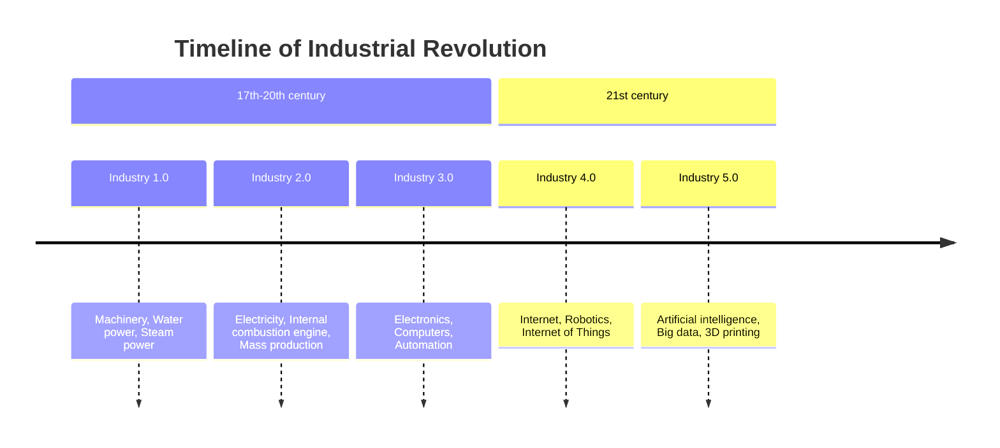
```mermaid
timeline
    title Timeline of Industrial Revolution
    section 17th-20th century
        Industry 1.0 : Machinery, Water power, Steam <br>power
        Industry 2.0 : Electricity, Internal combustion engine, Mass production
        Industry 3.0 : Electronics, Computers, Automation
    section 21st century
        Industry 4.0 : Internet, Robotics, Internet of Things
        Industry 5.0 : Artificial intelligence, Big data, 3D printing
```

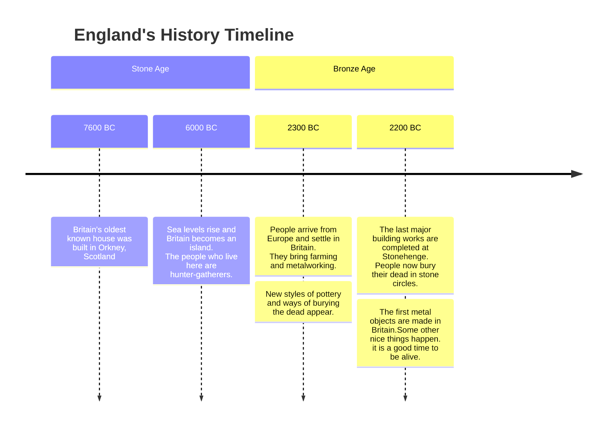
```mermaid
timeline
        title England's History Timeline
        section Stone Age
          7600 BC : Britain's oldest known house was built in Orkney, Scotland
          6000 BC : Sea levels rise and Britain becomes an island.<br> The people who live here are hunter-gatherers.
        section Bronze Age
          2300 BC : People arrive from Europe and settle in Britain. <br>They bring farming and metalworking.
                  : New styles of pottery and ways of burying the dead appear.
          2200 BC : The last major building works are completed at Stonehenge.<br> People now bury their dead in stone circles.
                  : The first metal objects are made in Britain.Some other nice things happen. it is a good time to be alive.
```

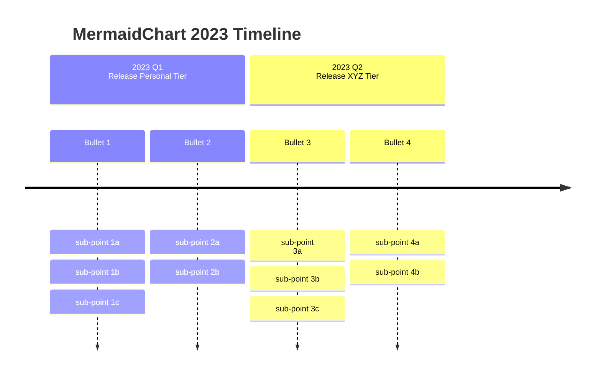
```mermaid
timeline
        title MermaidChart 2023 Timeline
        section 2023 Q1 <br> Release Personal Tier
          Bullet 1 : sub-point 1a : sub-point 1b
               : sub-point 1c
          Bullet 2 : sub-point 2a : sub-point 2b
        section 2023 Q2 <br> Release XYZ Tier
          Bullet 3 : sub-point <br> 3a : sub-point 3b
               : sub-point 3c
          Bullet 4 : sub-point 4a : sub-point 4b
```

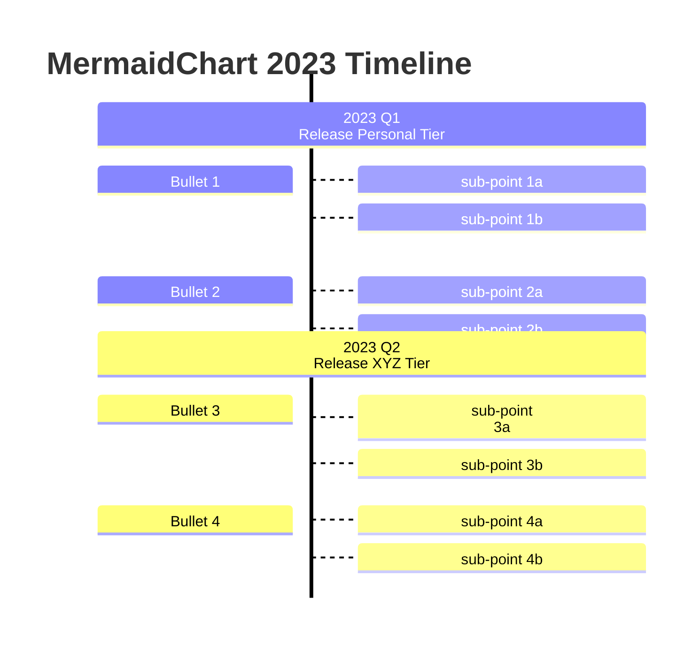
```mermaid
timeline TD
  title MermaidChart 2023 Timeline
    section 2023 Q1 <br> Release Personal Tier
      Bullet 1 : sub-point 1a : sub-point 1b
      Bullet 2 : sub-point 2a : sub-point 2b
    section 2023 Q2 <br> Release XYZ Tier
      Bullet 3 : sub-point <br> 3a : sub-point 3b
      Bullet 4 : sub-point 4a : sub-point 4b
```

```mermaid
    timeline
        title History of Social Media Platform
          2002 : LinkedIn
          2004 : Facebook : Google
          2005 : YouTube
          2006 : Twitter
```

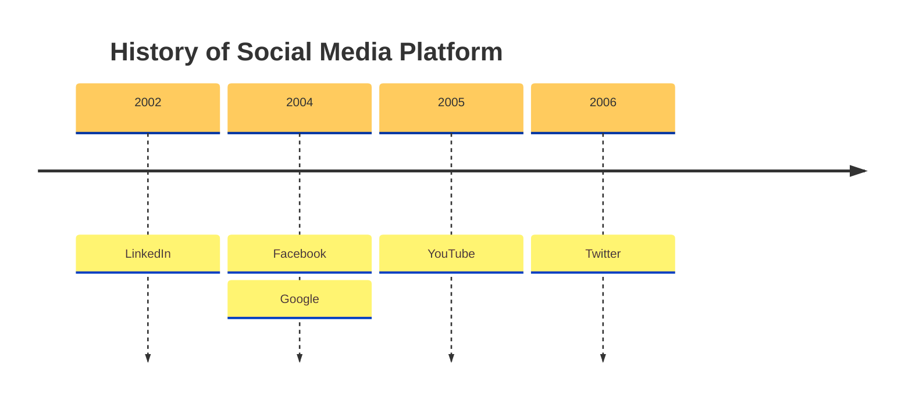
```mermaid
---
config:
  logLevel: 'debug'
  theme: 'base'
  timeline:
    disableMulticolor: true
---
    timeline
        title History of Social Media Platform
          2002 : LinkedIn
          2004 : Facebook : Google
          2005 : YouTube
          2006 : Twitter
```

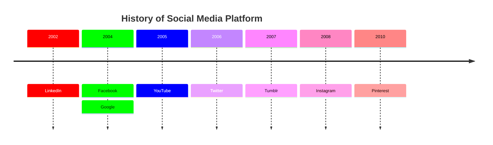
```mermaid
---
config:
  logLevel: 'debug'
  theme: 'default'
  themeVariables:
    cScale0: '#ff0000'
    cScaleLabel0: '#ffffff'
    cScale1: '#00ff00'
    cScale2: '#0000ff'
    cScaleLabel2: '#ffffff'
---
       timeline
        title History of Social Media Platform
          2002 : LinkedIn
          2004 : Facebook : Google
          2005 : YouTube
          2006 : Twitter
          2007 : Tumblr
          2008 : Instagram
          2010 : Pinterest
```

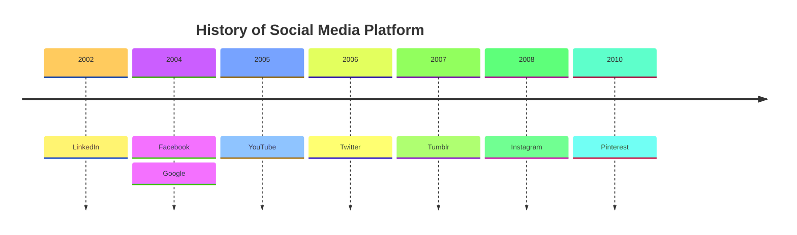
```mermaid
---
config:
  logLevel: 'debug'
  theme: 'base'
---
    timeline
        title History of Social Media Platform
          2002 : LinkedIn
          2004 : Facebook : Google
          2005 : YouTube
          2006 : Twitter
          2007 : Tumblr
          2008 : Instagram
          2010 : Pinterest
```

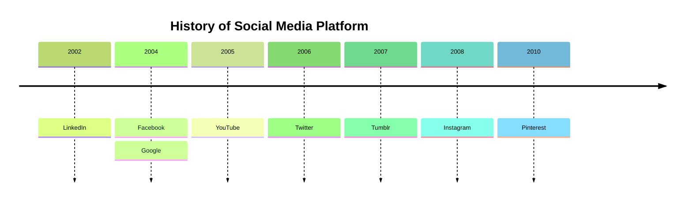
```mermaid
---
config:
  logLevel: 'debug'
  theme: 'forest'
---
    timeline
        title History of Social Media Platform
          2002 : LinkedIn
          2004 : Facebook : Google
          2005 : YouTube
          2006 : Twitter
          2007 : Tumblr
          2008 : Instagram
          2010 : Pinterest
```

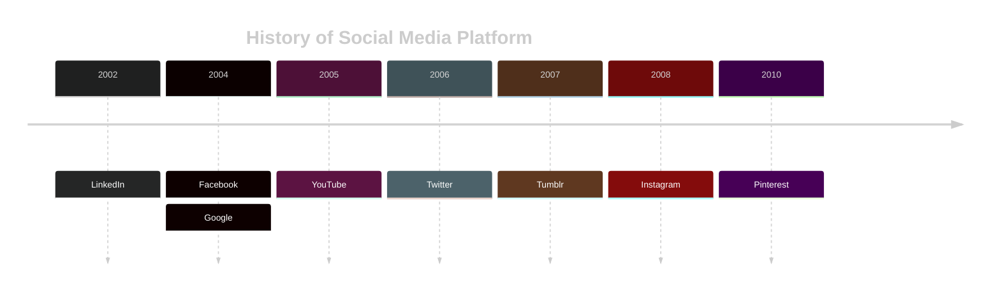
```mermaid
---
config:
  logLevel: 'debug'
  theme: 'dark'
---
    timeline
        title History of Social Media Platform
          2002 : LinkedIn
          2004 : Facebook : Google
          2005 : YouTube
          2006 : Twitter
          2007 : Tumblr
          2008 : Instagram
          2010 : Pinterest
```

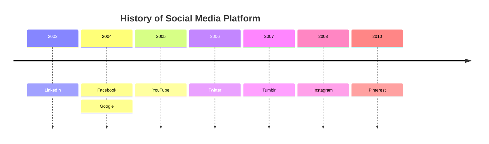
```mermaid
---
config:
  logLevel: 'debug'
  theme: 'default'
---
    timeline
        title History of Social Media Platform
          2002 : LinkedIn
          2004 : Facebook : Google
          2005 : YouTube
          2006 : Twitter
          2007 : Tumblr
          2008 : Instagram
          2010 : Pinterest
```

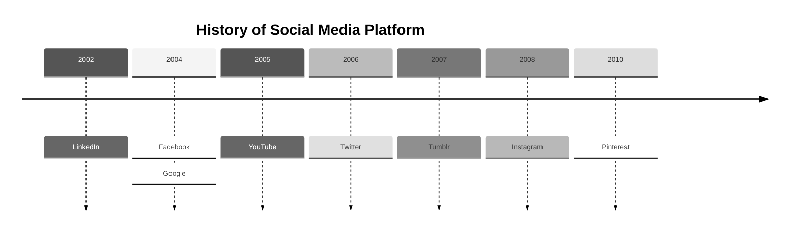
```mermaid
---
config:
  logLevel: 'debug'
  theme: 'neutral'
---
    timeline
        title History of Social Media Platform
          2002 : LinkedIn
          2004 : Facebook : Google
          2005 : YouTube
          2006 : Twitter
          2007 : Tumblr
          2008 : Instagram
          2010 : Pinterest
```
