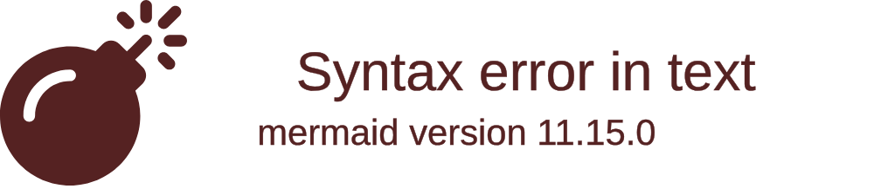
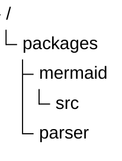
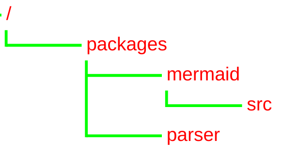

## Narrow screens

### Names and descriptions

Long filenames wrap. Descriptions move beneath their entries and the hierarchy remains visible.

```mermaid
treeView-beta
  project/
    this_is_a_long_filename_that_needs_to_wrap_on_a_phone.ts :::highlight ## A description that stays with the file when the layout narrows
    source/
      app.ts
```

## Documentation examples

```mermaid
treeView-beta
├── src/
│   ├── index.ts
│   └── utils.ts
├── package.json
└── README.md
```

```mermaid
treeView-beta
├── src/
│   ├── App.tsx :::highlight icon(logos:react) ## main component
│   └── index.ts ## entry point
├── .env ## environment variables
├── Dockerfile
└── package.json
```

```mermaid
treeView-beta
├── packages/
│   ├── mermaid/
│   │   ├── src/
│   │   │   ├── parser.ts
│   │   │   └── renderer.ts
│   │   └── package.json
│   └── parser/
│       └── src/
└── README.md
```

```mermaid
treeView-beta
    src/
        App.tsx :::highlight
        index.js
    package.json
```

```mermaid
treeView-beta
    src/
        index.js ## app entry point
        config.ts ## runtime configuration
    package.json ## project manifest
```

```mermaid
---
config:
  treeView:
    showIcons: true
---
treeView-beta
    src/
        index.js
    package.json
```

```mermaid
---
config:
  treeView:
    showIcons: true
    defaultIconPack: material-icon-theme
    filenameIcons:
      Dockerfile: docker
    extensionIcons:
      .ts: typescript
      .tsx: react-ts
      .txt: none
---
treeView-beta
    src/
        App.tsx
        utils.ts
    Dockerfile
    notes.txt
    README.md
```

```mermaid
treeView-beta
    src/
        App.tsx icon(logos:react)
        index.js
    package.json
```

```mermaid
---
config:
  treeView:
    showIcons: true
---
treeView-beta
    src/
        index.js icon(none)
    package.json
```

```mermaid
treeView-beta
    my-project/
        src/
            App.tsx :::highlight icon(logos:react) ## main component
            index.js ## entry point
        .env ## environment variables
        Dockerfile
        package.json
```

```mermaid
treeView-beta
    "packages"
        "mermaid"
            "src"
        "parser"
```

```mermaid
treeView-beta
    🚀 rocket-app/
        📦 packages/
            🎨 ui/
            🛠️ utils/
        🧪 tests/
        📝 README.md
        ⚙️ config.yaml
```

```mermaid
---
config:
    treeView:
        rowIndent: 80
        lineThickness: 3
    themeVariables:
        treeView:
            labelFontSize: '20px'
            labelColor: '#FF0000'
            lineColor: '#00FF00'
---
treeView-beta
    "packages"
        "mermaid"
            "src"
        "parser"
```
