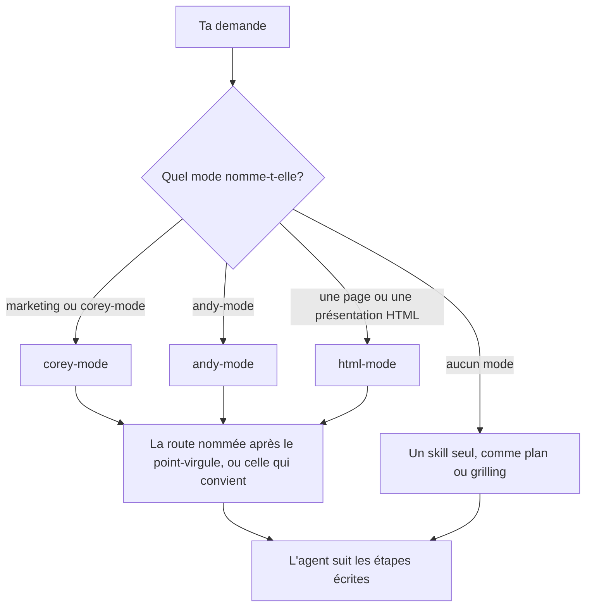

# Nommer un mode, puis la tâche

La plupart du travail passe par trois modes. Dans cette page, tu apprends les cinq mots du guide, tu vois comment une demande arrive au bon playbook et tu écris des demandes que l'agent dirige au bon endroit.

## Apprends cinq mots

Ces cinq mots reviennent à chaque page :

- **Agent** : l'IA de ton application
- **Skill** : des instructions écrites que l'agent suit pour un type de tâche, comme `plan`
- **Mode** : un skill qui ouvre une famille de routes, comme `corey-mode`
- **Route** : une tâche dans un mode, comme `copywriting`
- **Playbook** : les étapes écrites d'une route

## Vois ce que devient ta demande



L'agent lit ta demande, trouve le mode, puis ouvre la route. Si tu ne nommes aucun mode, l'agent cherche un skill seul qui correspond, comme `plan` ou `grilling`.

## Écris la demande : mode, point-virgule, tâche

Écris le mode, puis un point-virgule, puis la route, puis ce que tu veux :

```text
corey-mode ; cro. Voici le texte de ma page d'accueil. Pourquoi les visiteurs ne prennent-ils pas rendez-vous?
```

```text
andy-mode ; think. Est-ce que je passe ma petite équipe à la semaine de quatre jours?
```

```text
html-mode ; diagram. Montre comment une commande passe de notre site web à la livraison.
```

Les noms des modes et des routes restent en anglais, parce que l'agent cherche ces noms exacts dans la liste. Écris `corey-mode ; copywriting`, pas `corey-mode ; rédaction`. Le reste de ta demande peut être en français.

Chaque mode réagit un peu différemment :

- `corey-mode` démarre dès que ta demande contient le mot "marketing", alors `marketing ; cro` marche comme `corey-mode ; cro`. Sans nom de route, il choisit la route qui convient. Si deux routes conviennent, il nomme les deux et te demande de choisir.
- `andy-mode` démarre seulement si tu le nommes, suivi d'un point-virgule et d'une route. Les graphies de la dictée vocale comme "indie mode" ou "endymode" comptent aussi, ce qui aide sur un téléphone.
- `html-mode` démarre quand tu demandes une page ou une présentation HTML. Il choisit lui-même son playbook.

## Trouve la route qu'il te faut

Les routes de chaque mode figurent, avec une ligne chacune, dans [la liste des skills](../references/remote-skills-general.md). Pas besoin de la lire. Demande plutôt à l'agent :

```text
Quelle route de corey-mode convient à une série de courriels de bienvenue pour mes nouveaux clients?
```

L'agent lit la liste et nomme la route, ici `emails`. Tu demandes ensuite le travail.

## Appelle un skill sans mode

Certains skills fonctionnent seuls : `plan`, `grilling`, `research`, `unslop`, `concise` et `2nd-pass`. Nomme le skill dans ta demande :

```text
grilling. Mets à l'épreuve mon plan d'ouvrir une deuxième succursale au printemps.
```

Les pages 3 et 4 montrent les autres.

**Piège :** n'énumère pas plusieurs skills dans une demande, comme "utilise sparring, puis storytelling, puis copywriting". Donne le but et laisse le mode choisir. Nomme une route seulement quand tu en veux une précise, et lance l'étape suivante après avoir lu le premier résultat.

Suite : [Réfléchir avant que l'agent agisse](./03-think-first.md).
