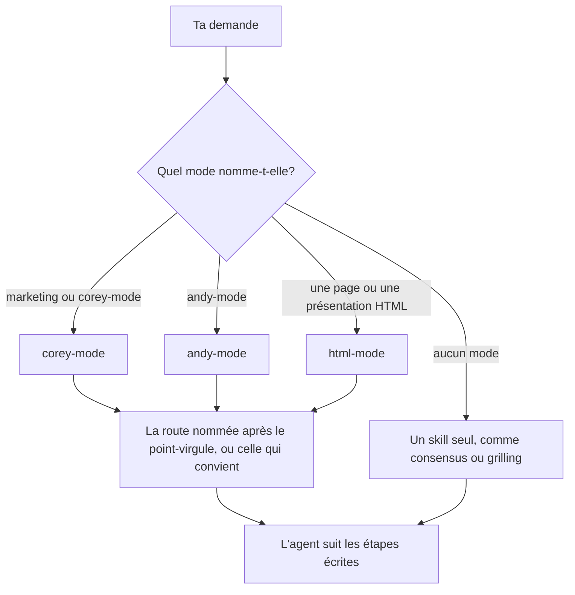

# Nommer un mode, puis la tâche

Trois modes portent l'essentiel du travail. Un mode regroupe des routes, et chaque route suit un playbook, c'est-à-dire des étapes écrites que l'agent applique.



## Écris le mode, un point-virgule, puis la route

```text
corey-mode ; cro. Voici le texte de ma page d'accueil. Pourquoi personne ne prend rendez-vous?
```

```text
andy-mode ; think. Est-ce que je passe mon équipe à la semaine de quatre jours?
```

```text
html-mode ; diagram. Montre le trajet d'une commande, du site web à la livraison.
```

Garde les noms de modes et de routes en anglais, parce que l'agent cherche ces noms exacts dans la liste. Le reste de la demande peut être en français.

- `corey-mode` démarre dès que le mot "marketing" apparaît. Sans route, il choisit celle qui convient, ou te fait trancher entre deux.
- `andy-mode` exige son nom, un point-virgule et une route. La dictée vocale passe : "indie mode" et "endymode" comptent.
- `html-mode` démarre quand tu demandes une page ou une présentation HTML, et choisit lui-même son playbook.

## Trouve la route

[La liste des skills](../references/remote-skills-general.md) décrit chaque route en une ligne. Plus simple, demande :

```text
Quelle route de corey-mode convient à une série de courriels de bienvenue?
```

L'agent répond `emails`.

## Appelle un skill seul

`consensus`, `brainstorm`, `grilling`, `research`, `unslop`, `concise` et `2nd-pass` fonctionnent sans mode. Nomme-les dans la demande.

**Piège :** énumérer les skills, comme "utilise sparring, puis storytelling, puis copywriting". Donne le but. Nomme une route seulement pour imposer un choix.

Suite : [Réfléchir avant de décider](./04-reflechir.md).
