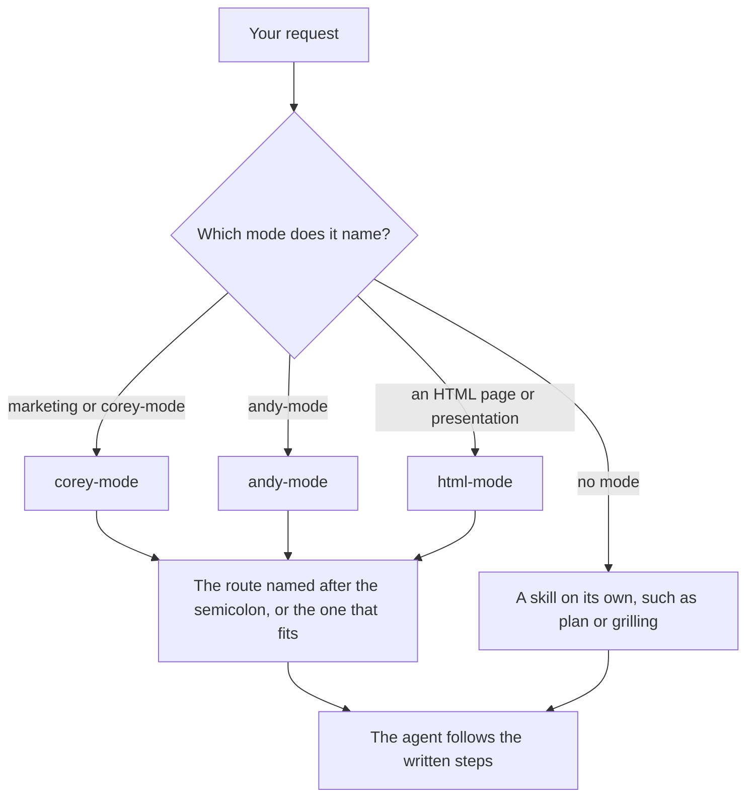

# Name a mode, then the task

Most of the work goes through three modes. In this page you learn the five words the guide uses, see how a request reaches a playbook, and write requests the agent routes the right way.

## Learn five words

These five words come back on every page:

- **Agent**: the AI in your chat app
- **Skill**: written instructions the agent follows for one kind of task, such as `plan`
- **Mode**: a skill that opens a family of routes, such as `corey-mode`
- **Route**: one task inside a mode, such as `copywriting`
- **Playbook**: the written steps of one route

## See what happens to your request



The agent reads your request, finds the mode, then opens the route. If you name no mode, the agent looks for a single skill that matches, such as `plan` or `grilling`.

## Write the request: mode, semicolon, task

Put the mode first, then a semicolon, then the route, then what you want:

```text
corey-mode ; cro. Here is my homepage text. Why don't visitors book a call?
```

```text
andy-mode ; think. Should I move my small team to a four-day week?
```

```text
html-mode ; diagram. Show how a customer order moves from our website to delivery.
```

Each mode reacts a little differently:

- `corey-mode` starts whenever your request contains the word "marketing", so `marketing ; cro` works like `corey-mode ; cro`. Without a route name, it picks the route that fits. If two fit, it names both and asks you to choose.
- `andy-mode` runs only when you name it, followed by a semicolon and a route. Voice dictation spellings such as "indie mode" or "endymode" count too, which helps on a phone.
- `html-mode` starts when you ask for an HTML page or an HTML presentation. It picks its own playbook from your request.

## Find the route you need

Each mode's routes appear, with one line each, in [the skills list](../references/remote-skills-general.md). You don't have to read it. Ask the agent instead:

```text
Which corey-mode route fits a welcome series for new clients?
```

The agent reads the list and names the route, here `emails`. Then you ask for the work.

## Call a skill without a mode

Some skills stand alone: `plan`, `grilling`, `research`, `unslop`, `concise`, and `2nd-pass`. Name the skill in your request:

```text
grill me on my plan to open a second location next spring
```

"Grill me" is enough to start `grilling`. Pages 3 and 4 show the others.

**Pitfall:** don't list several skills in one request, as in "use sparring, then storytelling, then copywriting". Give the goal and let the mode pick. Name a route only when you want a specific one, and run the next step after you read the first result.

Next: [Think before the agent acts](./03-think-first.md).
